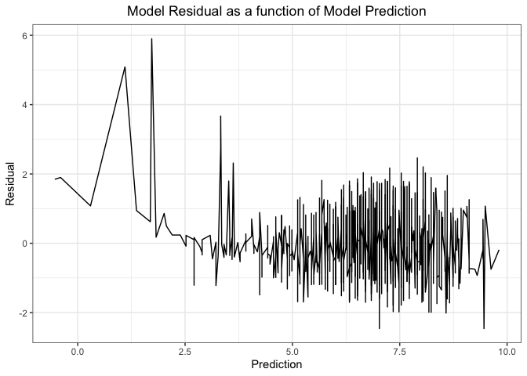
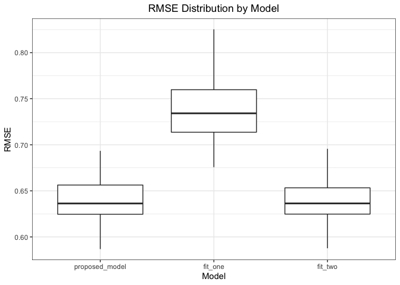
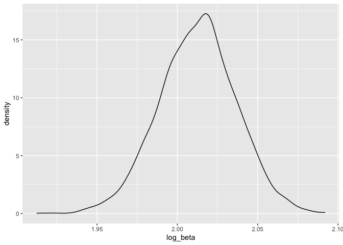
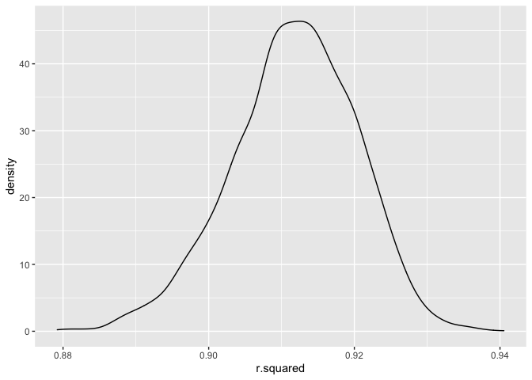

Homework 6
================
Teshawna Badu
12/04/2021

I’m an R Markdown document!

``` r
library(tidyverse)
```

    ## ── Attaching packages ─────────────────────────────────────── tidyverse 1.3.1 ──

    ## ✓ ggplot2 3.3.5     ✓ purrr   0.3.4
    ## ✓ tibble  3.1.5     ✓ dplyr   1.0.7
    ## ✓ tidyr   1.1.3     ✓ stringr 1.4.0
    ## ✓ readr   2.0.1     ✓ forcats 0.5.1

    ## ── Conflicts ────────────────────────────────────────── tidyverse_conflicts() ──
    ## x dplyr::filter() masks stats::filter()
    ## x dplyr::lag()    masks stats::lag()

``` r
library(readr)
library(modelr)
library(patchwork)
```

## Question 1

``` r
birthweight_df = 
  read_csv("./birthweight.csv") %>% 
  mutate(babysex = factor(babysex),
         frace = factor(frace),
         malform = factor(malform),
         mrace = factor(mrace)) %>% 
  mutate(bwt = bwt*0.00220462)
  birthweight_df %>% 
  skimr::skim()
```

|                                                  |            |
|:-------------------------------------------------|:-----------|
| Name                                             | Piped data |
| Number of rows                                   | 4342       |
| Number of columns                                | 20         |
| \_\_\_\_\_\_\_\_\_\_\_\_\_\_\_\_\_\_\_\_\_\_\_   |            |
| Column type frequency:                           |            |
| factor                                           | 4          |
| numeric                                          | 16         |
| \_\_\_\_\_\_\_\_\_\_\_\_\_\_\_\_\_\_\_\_\_\_\_\_ |            |
| Group variables                                  | None       |

Data summary

**Variable type: factor**

| skim\_variable | n\_missing | complete\_rate | ordered | n\_unique | top\_counts                     |
|:---------------|-----------:|---------------:|:--------|----------:|:--------------------------------|
| babysex        |          0 |              1 | FALSE   |         2 | 1: 2230, 2: 2112                |
| frace          |          0 |              1 | FALSE   |         5 | 1: 2123, 2: 1911, 4: 248, 3: 46 |
| malform        |          0 |              1 | FALSE   |         2 | 0: 4327, 1: 15                  |
| mrace          |          0 |              1 | FALSE   |         4 | 1: 2147, 2: 1909, 4: 243, 3: 43 |

**Variable type: numeric**

| skim\_variable | n\_missing | complete\_rate |   mean |    sd |     p0 |    p25 |    p50 |    p75 |   p100 | hist  |
|:---------------|-----------:|---------------:|-------:|------:|-------:|-------:|-------:|-------:|-------:|:------|
| bhead          |          0 |              1 |  33.65 |  1.62 |  21.00 |  33.00 |  34.00 |  35.00 |  41.00 | ▁▁▆▇▁ |
| blength        |          0 |              1 |  49.75 |  2.72 |  20.00 |  48.00 |  50.00 |  51.00 |  63.00 | ▁▁▁▇▁ |
| bwt            |          0 |              1 |   6.87 |  1.13 |   1.31 |   6.19 |   6.91 |   7.63 |  10.56 | ▁▁▇▇▁ |
| delwt          |          0 |              1 | 145.57 | 22.21 |  86.00 | 131.00 | 143.00 | 157.00 | 334.00 | ▅▇▁▁▁ |
| fincome        |          0 |              1 |  44.11 | 25.98 |   0.00 |  25.00 |  35.00 |  65.00 |  96.00 | ▃▇▅▂▃ |
| gaweeks        |          0 |              1 |  39.43 |  3.15 |  17.70 |  38.30 |  39.90 |  41.10 |  51.30 | ▁▁▂▇▁ |
| menarche       |          0 |              1 |  12.51 |  1.48 |   0.00 |  12.00 |  12.00 |  13.00 |  19.00 | ▁▁▂▇▁ |
| mheight        |          0 |              1 |  63.49 |  2.66 |  48.00 |  62.00 |  63.00 |  65.00 |  77.00 | ▁▁▇▂▁ |
| momage         |          0 |              1 |  20.30 |  3.88 |  12.00 |  18.00 |  20.00 |  22.00 |  44.00 | ▅▇▂▁▁ |
| parity         |          0 |              1 |   0.00 |  0.10 |   0.00 |   0.00 |   0.00 |   0.00 |   6.00 | ▇▁▁▁▁ |
| pnumlbw        |          0 |              1 |   0.00 |  0.00 |   0.00 |   0.00 |   0.00 |   0.00 |   0.00 | ▁▁▇▁▁ |
| pnumsga        |          0 |              1 |   0.00 |  0.00 |   0.00 |   0.00 |   0.00 |   0.00 |   0.00 | ▁▁▇▁▁ |
| ppbmi          |          0 |              1 |  21.57 |  3.18 |  13.07 |  19.53 |  21.03 |  22.91 |  46.10 | ▃▇▁▁▁ |
| ppwt           |          0 |              1 | 123.49 | 20.16 |  70.00 | 110.00 | 120.00 | 134.00 | 287.00 | ▅▇▁▁▁ |
| smoken         |          0 |              1 |   4.15 |  7.41 |   0.00 |   0.00 |   0.00 |   5.00 |  60.00 | ▇▁▁▁▁ |
| wtgain         |          0 |              1 |  22.08 | 10.94 | -46.00 |  15.00 |  22.00 |  28.00 |  89.00 | ▁▁▇▁▁ |

From the summary statistics provided by skimr, we see that there are no
missing data.

To predict the best model to use in this scenario, we can first start by
computing the pearson correlation coefficient between each variable and
birth weight.

``` r
birthweight_df %>%
  map(~cor(as.numeric(.x), pull(birthweight_df, bwt), method = "pearson")) %>%
  as_tibble() %>%
  pivot_longer(babysex:wtgain,
               names_to = "variables",
               values_to = "r") %>%
  knitr::kable()
```

| variables |          r |
|:----------|-----------:|
| babysex   | -0.0866418 |
| bhead     |  0.7471068 |
| blength   |  0.7434508 |
| bwt       |  1.0000000 |
| delwt     |  0.2878893 |
| fincome   |  0.1545715 |
| frace     | -0.1937446 |
| gaweeks   |  0.4121833 |
| malform   |  0.0013332 |
| menarche  | -0.0244247 |
| mheight   |  0.1921632 |
| momage    |  0.1357734 |
| mrace     | -0.2076689 |
| parity    | -0.0083741 |
| pnumlbw   |         NA |
| pnumsga   |         NA |
| ppbmi     |  0.0939457 |
| ppwt      |  0.1828920 |
| smoken    | -0.0756278 |
| wtgain    |  0.2472526 |

From this analysis, we can see that `bhead` (baby’s head circumference)
and `blength` (baby’s length at birth) are the only variables that have
pearson correlation coefficient greater than 0.5. I will choose to fit a
linear regression model with these two variables to predict birth
weight.

``` r
proposed_model <- lm(bwt ~ bhead + blength, data = birthweight_df)
```

We can now plot model residual as a function of model prediction.

``` r
# Get model predictions
# Get model residuals
# Plot line graph of model residual as a function of model prediction
birthweight_df %>%
  add_predictions(proposed_model) %>%
  add_residuals(proposed_model) %>%
  ggplot(aes(x = pred, y = resid)) +
  geom_line() +
  theme_bw() +
  theme(plot.title = element_text(hjust = 0.5)) +
  labs(
    title = "Model Residual as a function of Model Prediction",
    x = "Prediction",
    y = "Residual"
  )
```

<!-- -->
After plotting the model residual as a function of model prediction, we
see the model mostly underestimates birth weight for predicted values
less than around 4.4 pounds. For predicted birth weights greater than
4.4 pounds, the residual tends to oscillate, splitting over and under
zero.

We can now get the cross-validated predicted error for our proposed
model. Additionally, we can look at two other linear regression models:
first with birth length and gestational age without interaction term and
the second with head circumference at birth, birth length, sex, and all
interaction terms.

First we can create 100 80-20 training-test splits, then run of the
three models on each of the 100 training data sets. Lastly, we will test
each of the three models on each of the 100 training data and also
calculate RMSE.

``` r
crossvalidate_df <- crossv_mc(birthweight_df, 100) %>%
  mutate(
    train = map(train, as_tibble),
    test = map(test, as_tibble)
  ) %>%
  mutate(
    proposed_model = map(train, ~lm(bwt ~ bhead + blength, data = .x)),
    fit_one = map(train, ~lm(bwt ~ blength + gaweeks, data = .x)),
    fit_two = map(train, ~lm(bwt ~ bhead*blength*babysex, data = .x))
  ) %>%
  mutate(
    rmse_proposed_model = map2_dbl(proposed_model, test, ~rmse(model = .x, data = .y)),
    rmse_fit_one = map2_dbl(fit_one, test, ~rmse(model = .x, data = .y)),
    rmse_fit_two = map2_dbl(fit_two, test, ~rmse(model = .x, data = .y))
  )
```

We can now compare the root mean squared error of the three models with
a boxplot. We will create a boxplot to visualize the distribution of
RMSE for the 100 testing

``` r
crossvalidate_df %>%
  select(starts_with("rmse")) %>%
  pivot_longer(everything(),
               names_to = "model",
               values_to = "rmse",
               names_prefix = "rmse_") %>%
  mutate(model = fct_inorder(model)) %>%
  ggplot(aes(x = model, y = rmse)) +
  geom_boxplot() +
  theme_bw() +
  labs(
    x = "Model",
    y = "RMSE",
    title = "RMSE Distribution by Model"
  ) +
  theme(plot.title = element_text(hjust = 0.5))
```

<!-- --> We
see that our proposed model and the suggested model with predictors head
circumference, birth length, sex, and all interaction terms have similar
root mean squared error. However, the suggested model with predictors
birth length and gestational age without interaction term has the
highest root mean squared error among the three models.

## Question 2

``` r
weather_df = 
  rnoaa::meteo_pull_monitors(
    c("USW00094728"),
    var = c("PRCP", "TMIN", "TMAX"), 
    date_min = "2017-01-01",
    date_max = "2017-12-31") %>%
  mutate(
    name = recode(id, USW00094728 = "CentralPark_NY"),
    tmin = tmin / 10,
    tmax = tmax / 10) %>%
  select(name, id, everything())
```

    ## Registered S3 method overwritten by 'hoardr':
    ##   method           from
    ##   print.cache_info httr

    ## using cached file: ~/Library/Caches/R/noaa_ghcnd/USW00094728.dly

    ## date created (size, mb): 2021-10-17 15:31:57 (7.605)

    ## file min/max dates: 1869-01-01 / 2021-10-31

##### Use 5000 bootstrap samples and for sample produce estimates of r hat sqaure and log(*β̂*<sub>0</sub> \* *β̂*<sub>1</sub>)

``` r
weather_bootstrap = 
  weather_df %>% 
  select(tmax, tmin) %>% 
  bootstrap(n = 5000, id = "strap_number") %>%
  mutate(
    models = map(.x = strap, ~lm(tmax ~ tmin, data = .x)),
    results_coeff = map(models, broom::tidy),
    results_rsquare = map(models, broom::glance)
  ) %>% 
  select(strap_number, results_coeff, results_rsquare) %>% 
  unnest(results_coeff) %>% 
  select(strap_number,term, estimate, results_rsquare) %>% 
  unnest(results_rsquare) %>% 
  select(strap_number, term, estimate, r.squared)
```

``` r
beta0_df = 
  weather_bootstrap %>% 
  filter(term == "(Intercept)") %>% 
  select(strap_number, estimate) %>% 
  rename(beta0 = estimate)
beta1_df = 
  weather_bootstrap %>% 
  filter(term == "tmin") %>%
  select(strap_number,estimate) %>% 
  rename(beta1 = estimate)
betas_df = 
  inner_join(beta0_df, beta1_df, by = "strap_number") %>% 
  mutate(log_beta = log(beta0*beta1))
betas_df %>% 
  ggplot(aes(log_beta)) +
  geom_density()
```

<!-- -->

Overall we see that The distribution of log(*β̂*<sub>0</sub> \*
*β̂*<sub>1</sub>) looks fairly normally distributed.

##### We can now identify the 2.5% and 97.5% quantiles to provide a 95% confidence interval for log(*β̂*<sub>0</sub> \* *β̂*<sub>1</sub>)

``` r
quantile(betas_df$log_beta, c(.025, 0.975)) 
```

    ##     2.5%    97.5% 
    ## 1.964099 2.059021

Our results show that the 95% confidence interval for
log(*β̂*<sub>0</sub> \* *β̂*<sub>1</sub>) is (1.96, 2.05).

##### We will repeat the same proccess for r hat sqaure

``` r
rsquare_df = 
  weather_bootstrap %>% 
  select(strap_number, r.squared) %>% 
  distinct(strap_number, .keep_all = TRUE)
rsquare_df %>% 
  ggplot(aes(r.squared)) +
  geom_density()
```

<!-- -->
The distribution of r hat square fairly normal distribution but with a
slightly left-skewedness.

``` r
quantile(rsquare_df$r.squared, c(.025, 0.975)) 
```

    ##      2.5%     97.5% 
    ## 0.8934429 0.9269960

Our results show that the 95% confidence interval for r hat square is
(0.89, 0.92).
